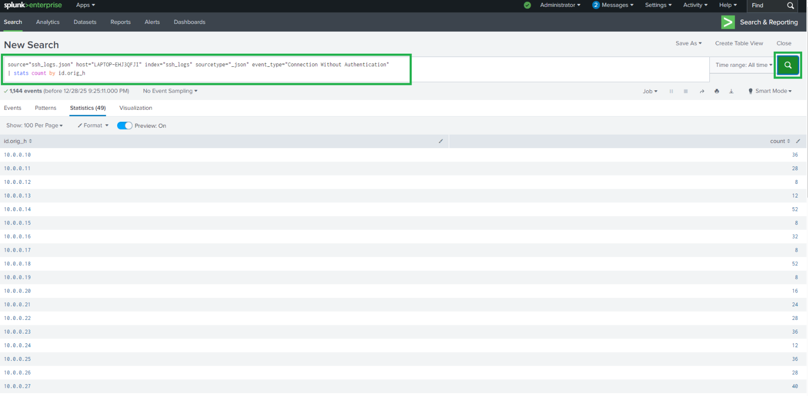
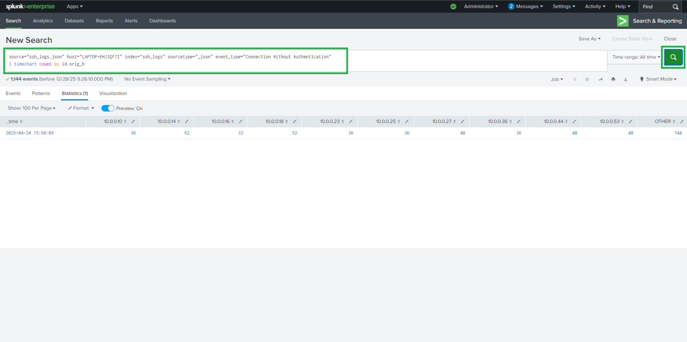

# Log Analysis using Splunk

# Project Overview
This project demonstrates SSH authentication log analysis using Splunk SIEM to detect malicious activity such as brute-force attacks, unauthorized access attempts, and suspicious SSH behavior.

It simulates real-world SOC analyst workflows, including log ingestion, SPL queries, dashboards, and alerting.

# Objectives
The project aims to detect and analyze:

* ✅ Successful SSH logins (source and destination analysis)
* ❌ Failed login attempts (password guessing & spraying)
* 🚨 Multiple failed authentication attempts (brute-force indicators)
* 🔍 Connections without authentication (SSH probing or scanning)

#   Lab Setup & Prerequisites
# Prerequisites
* Splunk Enterprise / Splunk Free
* Basic understanding of SPL
# Dataset
* ssh_log.json (JSON-formatted SSH authentication logs)

### ⚙️ Environment Setup

1. **Log in to Splunk Web:** Access your Splunk instance via the browser.
2. **Navigate to :**
   
   **Apps** → **Search & Reporting**.

   

   

3. **Click:**  
  **Add Data** → **Upload**


4. **Upload:** 
   `ssh_log.json`.
   
   

5. **Configure Input Settings:**
   * **Source type:** `_json`
   * **Index:** `ssh_logs`
  
   
   
   
   
   
   
   

6. **Click Start Searching**
    

## 🛠️ Step-by-Step Implementation

### 🔹 Task 1: Log Ingestion & Parsing

**Extracted Fields:**
* `event_type`
* `auth_success`
* `auth_attempts`
* `id.orig_h` (Source IP)
* `id.resp_h` (Destination Host)

**Validation Query:**
```spl
index=ssh_logs
| stats count by event_type
```
 Confirms successful ingestion and parsing.

  

### 🔹 Task 2: Failed Login Analysis

**SPL Query:**
```spl
index=ssh_logs event_type="Failed SSH Login"
| stats count by id.orig_h
| sort - count
| head 10
```
 


### 🔹 Task 3: Brute-Force Detection

**Multiple Failed Attempts Query:**
```spl
index=ssh_logs event_type="Multiple Failed Authentication Attempts"
| stats count by id.orig_h, id.resp_h
| where count > 5
```


#### 🚨 Alert Configuration

| Setting | Configuration |
| :--- | :--- |
| **Trigger Condition** | `> 5 failed attempts` |
| **Time Window** | `10 minutes` |
| **Alert Type** | `Scheduled / Real-Time` |
| **Trigger Action** | `SOC notification or email` |

> 📌 **Purpose:** Early detection of brute-force attacks.


### 🔹 Task 4: Successful SSH Login Tracking

**SPL Query:**
```spl
index=ssh_logs event_type="Successful SSH Login"
| stats count by id.orig_h, id.resp_h
```


### 🔍 Security Correlation

* **Failed vs. Successful Analysis:** Compare source IPs performing successful logins against prior failed attempts.
* **Threat Detection:** Identify possible compromised credentials or successful brute-force intrusions.

> 📊 **Dashboard Panel:**
* Top source IPs with successful SSH access.


### 🔹 Task 5: Unauthenticated SSH Connections

**Detection Query:**
```spl
index=ssh_logs event_type="Connection Without Authentication"
| stats count by id.orig_h
```


####  Time-Based Monitoring

```spl
index=ssh_logs event_type="Connection Without Authentication"
| timechart count by id.orig_h
```


📌 Purpose: Detect reconnaissance, SSH probing, or port scanning.

## 📊 Dashboards Implemented

| Dashboard Panel | Description / Use Case | Recommended Visualization |
| :--- | :--- | :--- |
| 🔐 **SSH Successful Login Monitoring** | Tracks verified and authenticated SSH access by source and destination hosts. | Statistics Table / Single Value |
| ❌ **Failed Authentication Attempts** | Aggregates and ranks source IPs generating repeated login failures. | Bar Chart / Top List |
| 🚨 **Brute-Force Detection** | Pinpoints high-frequency repeated authentication failures exceeding security thresholds (`> 5 attempts`). | Alert Table / Gauge |
| 🔍 **Unauthenticated SSH Connection Trends** | Monitors time-series patterns of connection attempts made without proper credentials. | Area / Line Timechart |

## 🚨 Alerts Implemented

| Alert Name | Condition | Time Window | Action |
| :--- | :--- | :--- | :--- |
| **Brute Force Detection** | `> 5 failed attempts` | 10 minutes | SOC Notification / Email Alert |

## 🧠 Skills Demonstrated

* 🛡️ **SIEM & Security Monitoring:** Splunk Enterprise / Splunk Cloud
* 💻 **SPL Proficiency:** Query optimization, aggregations, filtering, and time-series analysis (`stats`, `timechart`, `where`, `eval`)
* 📑 **Log Parsing & Ingestion:** Structured JSON schema handling, field extraction, and index management
* 🚨 **Threat Detection:** Brute-force identification, credential abuse monitoring, and threshold-based alerting
* 📊 **Visualization & SOC Operations:** Security dashboard design, correlation workflows, and triage alerting

  # 📌 Conclusion
* The Splunk Log Analysis project establishes an end-to-end security monitoring and threat detection workflow for SSH authentication logs. By taking raw, semi-structured JSON telemetry and operationalizing it within Splunk, the implementation achieves:

* High-Fidelity Detection: Automatically surfaces brute-force campaigns by isolating repeated authentication failures exceeding safe baseline thresholds (> 5 failures in 10 mins).

* Compromised Account Discovery: Enables security correlation between anomalous failed attempt spikes and subsequent successful logins to detect valid credential compromise.

* Proactive Reconnaissance Monitoring: Visualizes time-series trends for unauthenticated connections and unauthorized access attempts before exploitation escalates.

* SOC Operations Readiness: Translates complex event streams into structured dashboards and alert rules, demonstrating practical Splunk SPL proficiency, log parsing, and SIEM monitoring best practices.

